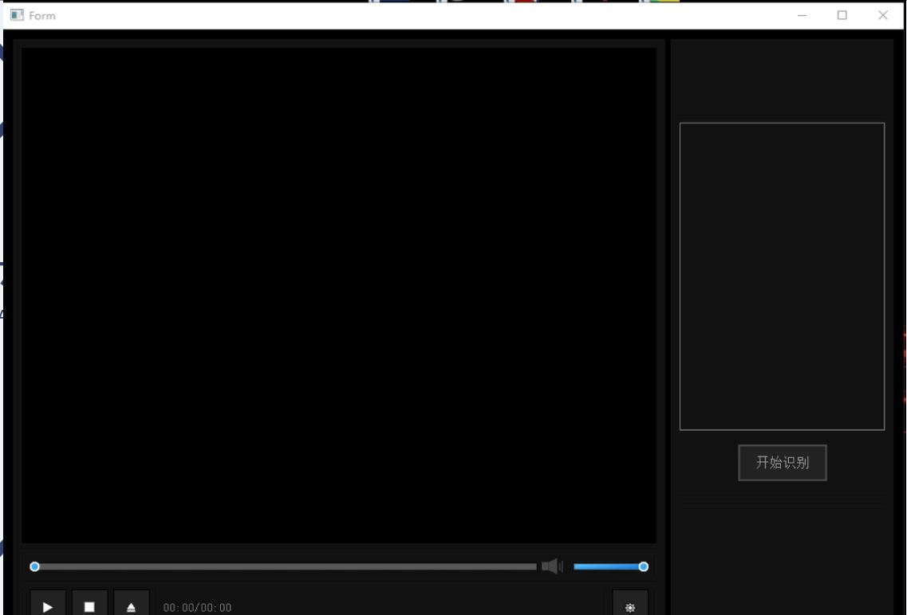
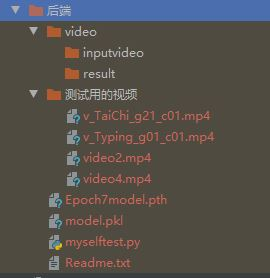

# Readme
## Introduction
This project is a video behavior recognition project based on deep learning. It mainly contains three modules, including a player module, an output log module, and a model training module. Reading this document you can know the following:
   1. How to divide the data set into training set and test set proportionally? (Take UCF101 as an example)
   2. How to convert a video data set to a picture data set?
   3. How to call Pytorch's own pre-training model training pictures?
   4. How to modify the pre-training model?(Take Inception-v3 as an example)
   5. How to make a player software with the function of recognizing human behavior video?
***
## 简介 
  本项目是基于深度学习的视频行为识别项目，主要含有三个模块，包括播放器模块、输出日志模块、模型训练模块。查阅本文档你可以得知以下内容：
  1. 如何按比例分割数据集为训练集与测试集？（以UCF101为例）
  2. 如何将视频数据集转为图片？
  3. 如何调用Pytorch自带的预训练模型训练图片？
  4. 如何修改预训练模型（以Inception-v3为例）？
  5. 如何制作一个具有识别人体行为视频功能的播放器软件？

 ## Preview 效果预览 
  这个项目做的比较早了，当时没有系统学过Qt前端，所以界面丑一点哈哈，看一下效果就行了
  ### Homepage 播放器主界面 
  

  The left side is the video preview, you can drag the progress bar to watch, you can also pause the playback, and the right box can output the identification log.
  
  左侧为视频预览，可以拖动进度条观看，可以暂停播放，右侧方框可以输出识别日志。

  ### 上传视频 & 识别结果
  
  
  
  

  These video actions are all human actions in the UCF101 data set. The first video comes from UCF101 training set, and the latter two are recorded by ourselves and are not included in the data set. The above three video recognition results are all correct.

  这些视频动作均为UCF101数据集中的人体动作类，其中第一个视频为训练集中的视频，后两个为我们自己录制，不包含在数据集中，用于测试的视频。以上三个视频识别结果均正确。

  ## Code interpretation 代码解读
  ### Split the video data set 分割视频数据集

  UCF101 officially provides a txt file for dividing the video data set into train set and test set. We only need to read the file list and process it on the string to obtain the file names in the training set and test set, and then use Functions in python to create folders and move videos.

  UCF101官方提供了txt文件用于分割视频数据集为训练集和测试集，我们只需要读取文件列表，并对其进行字符串上的处理，从而获得训练集和测试集中的文件名称，再使用python中函数创建文件夹、移动视频即可。


group_list函数中，首先获取参数version，该参数代表读取的是ucfTrainTestlist中的哪一个组合，总共有01、02、03三种组合。

利用strip、split等字符串操作，读取每一个视频路径，获得的train_list、test_list为列表，列表中每一项格式如下，以此类推。
```bash
ApplyEyeMakeup/v_ApplyEyeMakeup_g08_c01.avi
```

group是包含了train_list和test_list的字典。


move_data的参数为上面获得的group，在函数中，首先对group中字符串进行分析，获得动作名和视频文件名，并利用python中函数创建文件夹，移动视频。以ApplyEyeMakeup/v_ApplyEyeMakeup_g08_c01.avi为例子。

```bash
#这是group中trainlist列表中的第一项
ApplyEyeMakeup/v_ApplyEyeMakeup_g08_c01.avi
```

```python
'''
    file = 'train','test'
    videos = train_list,test_list
    (以第一项为例)
    name = ['ApplyEyeMakeup','v_ApplyEyeMakeup_g08_c01.avi']
    classname = ApplyEyeMakeup
    filename = v_ApplyEyeMakeup_g08_c01.avi
'''     
for file,videos in group.items():
    for real_video in videos:
        name = real_video.split('/')

        classname = name[0]
        filename = name[1]
'''
    确认路径：
    train/ApplyEyeMakeup(文件夹是否存在，如果不存在，则创建)
    test/ApplyEyeMakeup(文件夹是否存在，如果不存在，则创建)

    确认路径：
    ./ApplyEyeMakeup/v_ApplyEyeMakeup_g08_c01.avi是否存在，
    如果UCF101中存在该文件，才可以继续，接下来的复制。
'''

        if not os.path.exists(file + '/' + classname):
            print("Creating folder for %s/%s" %(file, classname))
            os.makedirs(file + '/' + classname)

        if not os.path.exists('./' + classname + '/' + filename):
            print('/' + classname + '/' + filename)
            print("Can't find %s." % (filename))
            continue

'''
    dest为目标目录：
    train/ApplyEyeMakeup/v_ApplyEyeMakeup_g08_c01.avi
    test/ApplyEyeMakeup/v_ApplyEyeMakeup_g08_c01.avi

    original为原地址
'''
        dest = file + '/' + classname + '/' + filename
            #print(dest)
            original = os.path.join(classname, filename)
            print("Moving %s to %s" % (filename, dest))
            os.rename(original, dest)
```

以上操作后可以获得两个文件夹，train和test，目录结构如下：


使用函数将空余文件夹删除


就此，我们成功将训练集与测试集分开，接下来要对视频进行解帧，从而获得图片。

### Use ffmpeg deframe videos into pictures 
### 视频解帧为图片


见图片代码注释可知，get_video_name函数可以返回四个值，分别是
```bash
train_test:视频来源于训练集or测试集
classname:ApplyEyeMakeup
filename_no_dot:v_ApplyEyeMakeup_g08_c01
filename:v_ApplyEyeMakeup_g08_c01.avi
```


接下来的conver函数将调用以上两个函数用于确认是否存在图片，以及创建文件夹。


```python
''' file:train/test
    search_folders: 列表 第一项：ApplyEyeMakeup
    avi_file: 列表 第一项：v_ApplyEyeMakeup_g08_c01.avi

    src = train/ApplyEyeMakeup/v_ApplyEyeMakeup_g08_c01.avi 
    jpg_path = train/ApplyEyeMakeup/
    dest = train/ApplyEyeMakeup/v_ApplyEyeMakeup_g08_c01_00001.jpg

    call函数调用ffmpeg，这里参数1的意思是每一秒抽取一帧
'''
```
获得的文件结构如下：


至此，我们已经完成了数据预处理的基本操作，接下来开始是训练模型部分。因为接下来的训练只会使用到图片，所以要将train和test中的视频手动删除。
***

### Model Training 模型训练


使用Pytorch中的DataLoader导入，前面之所以设置那样的文件目录是因为这是DataLoader的要求，详见[Pytorch官方文档](https://pytorch.org/docs/stable/data.html)。

Resize(299,299)是模型Inception-v3的需要。

batch_size = 64是我们根据实验获得的最佳超参数，可以根据实际个人配置进行调整。


在get_model函数中调用inception-v3，并添加两个线性全连接层，添加Dropout和LeakyRelu防止过拟合。
这里仅仅做了最简单的修改，Pytorch预训练模型自由度很高，支持屏蔽某些层等更高级的修改。

最后一个Linear的最后一个参数应该为动作类别的数量，可以通过读取文件夹个数获取，这里直接写101是因为UCF101总共101个动作，偷了个懒XD

之后的训练过程和图像识别基本一致，这里简单解释，详情可以参照[Pytorch官方案例](https://pytorch.org/tutorials/beginner/transfer_learning_tutorial.html)。


定义模型，device，optimizer等，optimizer类型和learning_rate均可以修改。


训练阶段，注释部分可以保存模型state，中途停止后可以读取State继续运行。


上面这张图片读取了state，这样我们一旦停止训练，下一次无需从Epoch=1开始，state中已经保存了相关参数。


验证部分。
实际上真正过程中应该分为Training,Testing,和Validation，但是由于UCF101官方给的文件仅区分了training和testing，且作者做这个项目的时候对于深度学习不甚了解，所以本项目中没有区分testing和validation。

至此，训练和验证部分结束，每一个Epoch我们均保存了参数，挑选最佳参数读取即可。接下来将进入软件开发部分。

***

前端部分参照各大Qt教程即可，这里简单写一下如何使用我们训练获得的参数，如何用来识别自己录制的视频。

首先，我们需要保存get_model()中的模型，并命名为model.pkl。
并按照一下文件目录放置文件。Epoch7model.pth为我们保存的一个state，要识别视频，请将测试用的视频文件夹中【一个】视频复制到inputvideo文件夹中。




基本操作，定义transform，device,path


move_video和convert和前面基本一致，都是为了移动视频并转换为图片。


获取视频名称


读取参数导入model。
preds为列表，第一项为可能性最高的动作编号，如ApplyEyeMakeup的编号为0，若该动作最有可能是ApplyEyeMakeup，则preds[0]=0，从classes中获取classes[0] = ApplyEyeMakeup


为了下一次识别的需要，在识别后需要将inputvideo和result中的视频图片删除。

***
本项目代码解读就此结束，获得的识别准确率、训练测试准确率、loss等数据由于论文尚未发表，暂时不公布。之后会来除个草。
